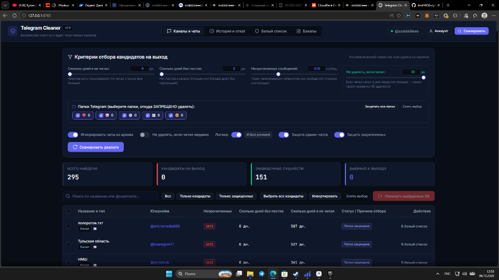
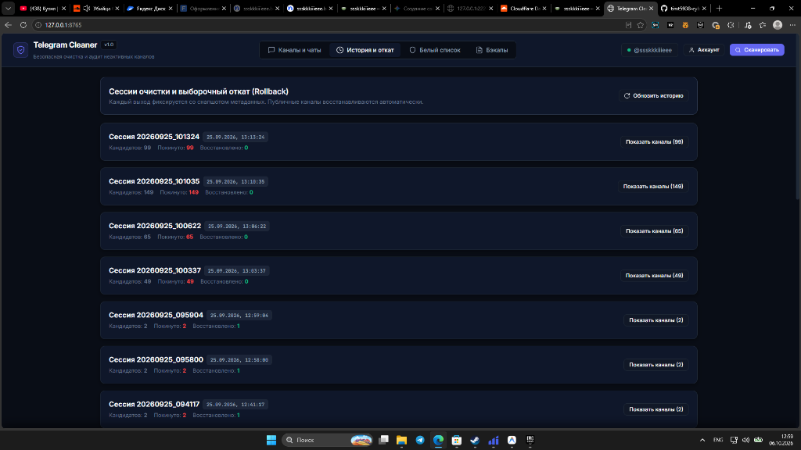
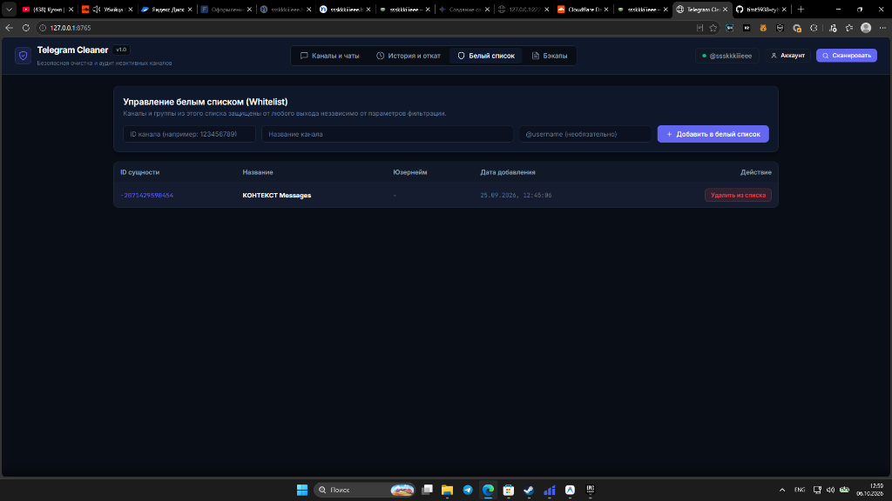
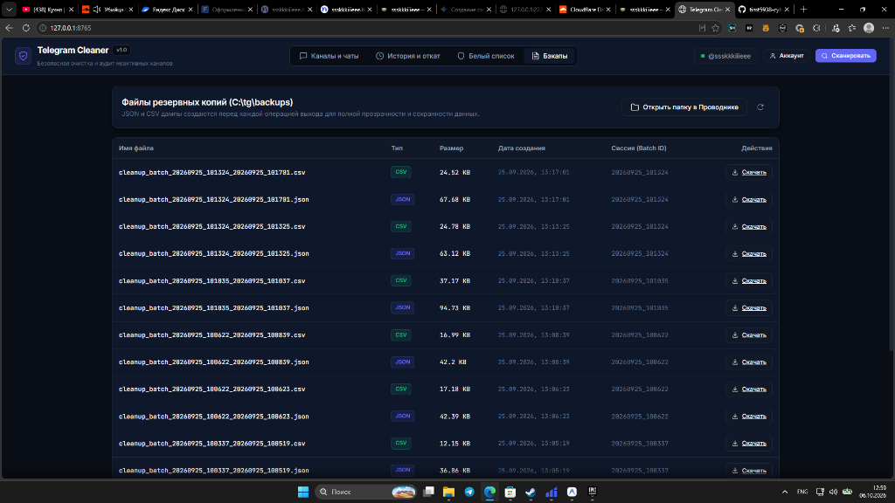

# TGclear

> Локальное приложение для быстрой и безопасной очистки Telegram от заброшенных каналов, мертвых пабликов и забытых групп. С локальными бэкапами, защитой папок, админ-чатов и возможностью отката.

Сделал: **ssskkkiiieee**  
Сайт автора: https://ssskkkiiieee.bond/
Репозиторий: [timt5938-cyber/TGclear](https://github.com/timt5938-cyber/TGclear)

---

## Как получить API ключи (api_id и api_hash) от Telegram

Для работы приложения нужны официальные ключи разработчика Telegram API. Они выдаются бесплатно самому себе в пару кликов:

1. Перейдите на официальный портал Telegram: **https://my.telegram.org**
2. Введите свой номер телефона в международном формате (например, `+7915...`).
3. Введите код подтверждения, который придет в официальный чат Telegram.
4. Откройте раздел **API development tools**.
5. Заполните поля `App title` и `Short name` (любые слова на английском, например `TGclear` и `tgcleaner`), нажмите **Create application**.
6. Скопируйте полученные **App api_id** (число) и **App api_hash** (строка из букв и цифр).

> [!IMPORTANT]
> **Важное примечание для пользователей из России:**  
> Сайт `my.telegram.org` часто выдает ошибку ("ERROR"), бесконечно крутит загрузку или не отправляет код на российские IP-адреса.  
> Чтобы спокойно войти и получить ключи, **обязательно включите VPN с локацией стран СНГ** (Казахстан, Беларусь, Армения) либо стабильный европейский сервер.

---

## Интерфейс и разбор функций

### 1. Главный экран: Каналы и чаты

На главном экране настраиваются условия отбора, просматриваются найденные каналы и запускается очистка.



#### Разбор элементов управления:

- **Кнопка «Сканировать» (вверху справа):**  
  Запускает проверку всех диалогов через MTProto API. Личные сообщения с людьми и ботами отсекаются сразу и намертво. Их нет в списке, и удалить их невозможно.
- **Индикатор аккаунта:**  
  Показывает текущий статус подключения и ваш юзернейм в Telegram.

#### Блок критериев отбора:
- **Сколько дней я не читал:**  
  Показывает, сколько дней вы не заходили в канал. Значение можно менять как ползунком, так и вбивать любое точное число в поле руками (хоть 110, хоть 450).
- **Сколько дней без постов:**  
  Отбирает заброшенные каналы, где автор ничего не публиковал указанное количество дней. Также настраивается ползунком или прямым вводом числа.
- **Непрочитанных сообщений:**  
  Порог накопленных непрочитанных постов в канале (например, от 200 или от 1000).
- **Не удалять, если читал (зеленое поле):**  
  Жесткий защитный порог. Если вы открывали и читали канал 2 дня назад или меньше, приложение гарантированно снимет с него статус кандидата и сохранит его.

#### Защита папок Telegram:
- **Интерактивные чипы папок:**  
  Приложение автоматически считывает ваши реальные папки из Telegram (с эмодзи и счетчиками чатов). При клике на папку она загорается синим, а все каналы из нее получают иммунитет от удаления.
- **Кнопка «Защитить все папки»:**  
  В один клик включает защиту для всех найденных папок.
- **Кнопка «Снять выбор»:**  
  Снимает защиту со всех папок.

#### Переключатели безопасности:
- **Игнорировать чаты из архива:**  
  Полностью исключает архивные каналы и чаты из выборки.
- **Не удалять, если читал недавно:**  
  Включает правило защиты недавно прочитанных каналов.
- **Логика (ИЛИ / И):**  
  В режиме **ИЛИ** канал помечается кандидатом, если совпало хотя бы одно условие. В режиме **И** должны одновременно совпасть все выставленные условия.
- **Защита админ-чатов:**  
  Каналы и супергруппы, где вы создатель или администратор, защищены по умолчанию.
- **Защита закрепленных:**  
  Закрепленные в самом верху чаты не трогаются.

#### Карточки метрик:
- **Всего найдено:** общее число проанализированных каналов и групп.
- **Кандидаты на выход:** число каналов, которые подошли под выбранные фильтры.
- **Защищенные сущности:** чаты с активным иммунитетом (папки, админка, закреп, белый список).
- **Выбрано к выходу:** сколько каналов отмечено галочками в таблице прямо сейчас.

#### Таблица и действия:
- **Поиск:** мгновенная фильтрация по названию или `@username`.
- **Чипы фильтрации таблицы:** «Все», «Только кандидаты», «Только защищенные».
- **Кнопка «Выбрать все кандидаты»:** мгновенно отмечает галочками всех кандидатов.
- **Кнопка «Инвертировать»:** меняет текущий выбор галочек на противоположный.
- **Кнопка «Снять выбор»:** сбрасывает все галочки.
- **Кнопка «Покинуть выбранные»:** открывает модальное окно с подтверждением и запускает безопасный выход.

---

### 2. История и выборочный откат (Rollback)

В этой вкладке хранятся все сессии предыдущих выходов.



#### Что здесь находится:
- **Список сессий очистки:**  
  Каждое нажатие на кнопку очистки фиксируется в отдельную сессию со штампом даты и времени.
- **Кнопка «Показать каналы»:**  
  Раскрывает таблицу со списком всех каналов, которые были покинуты в рамках этой сессии.
- **Кнопка «Восстановить выбранные»:**  
  Позволяет отметить галочками нужные каналы и вернуть аккаунт только в них.
- **Кнопка «Восстановить всё (публичные)»:**  
  В один клик подписывает вас обратно на все публичные каналы с юзернеймом `@username`.
- **Защита от спама:**  
  Восстановление выполняется с мягкими задержками между запросами и автоматической обработкой ограничений FloodWait.

---

### 3. Белый список (Whitelist)

Белый список нужен для вечной защиты каналов, которые вам дороги, даже если в них нет постов годами.



#### Как это работает:
- Каналы из белого списка получают постоянный статус «Белый список». Они никогда не попадут в кандидаты на удаление.
- **Добавление из таблицы:** в главной таблице у каждого канала есть кнопка «В белый список».
- **Ручное добавление:** прямо на этой вкладке можно вбить ID канала или юзернейм и сохранить его в базу.
- Все записи хранятся в локальной базе данных SQLite и сохраняются между перезапусками приложения.

---

### 4. Файлы резервных копий (Бэкапы)

Перед каждым выходом из каналов TGclear формирует полные резервные копии.



#### Что дают бэкапы и как восстанавливать данные:
- **Форматы JSON и CSV:**  
  Для каждой сессии создается подробный JSON со всеми техническими метаданными и удобный CSV файл со списком каналов (ID, название, юзернейм, тип, дата выхода, причина отбора).
- **Кнопка «Открыть папку в Проводнике»:**  
  Мгновенно открывает папку `C:\tg\backups\` в Проводнике Windows.
- **Кнопка «Скачать»:**  
  Позволяет скачать файл резервной копии прямо через браузер.
- **Как восстановить каналы вручную:**  
  Если вы захотите восстановить подписки позже, откройте CSV файл в Excel или Блокноте. Там сохранены прямые юзернеймы (`@username`) и ссылки на все покинутые каналы. Достаточно кликнуть по ним или вбить в поиск Telegram, чтобы подписаться заново.

---

## Быстрый запуск

### Запуск в один клик на Windows
Запустите файл `run.bat` из папки проекта:
```cmd
run.bat
```
Скрипт сам проверит Python, доставит зависимости и откроет веб-интерфейс в браузере по адресу `http://127.0.0.1:8765`.

### Запуск вручную из консоли
```bash
# 1. Установка зависимостей
pip install -r requirements.txt

# 2. Запуск сервера
python main.py
```

### Запуск тестов
```bash
python -m pytest tests -v
```
Все 41 тест проходят полностью в изолированном mock-режиме без использования реальной сессии Telegram.

---

## Безопасность и приватность

- **Все данные хранятся локально:**  
  Файл сессии (`data/telegram.session`), локальная база (`data/tg_cleaner.db`) и бэкапы (`backups/`) хранятся только на вашем компьютере. Они внесены в `.gitignore` и никогда не попадут в репозиторий.
- **Никаких сторонних серверов:**  
  Приложение общается напрямую с серверами Telegram через библиотеку Telethon по официальному протоколу MTProto.

---

