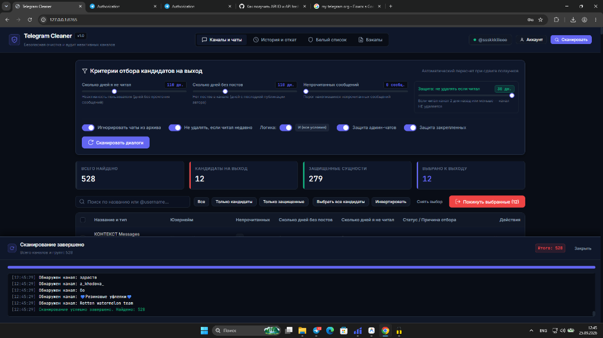
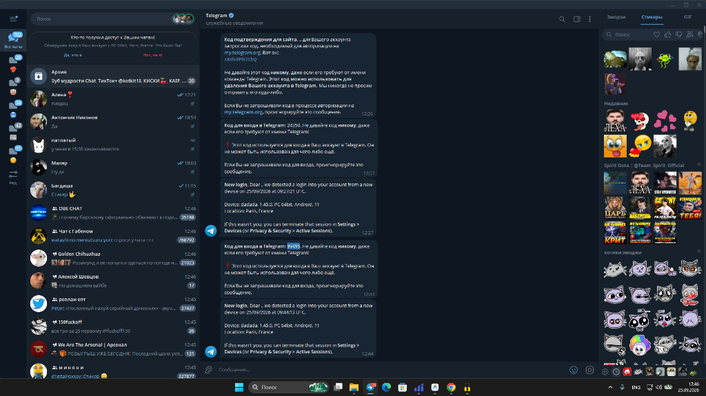
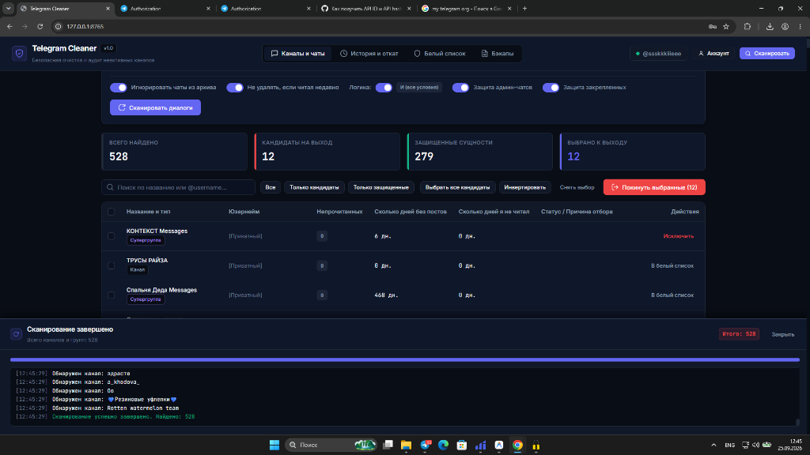

# TGclear

> Быстрая и безопасная очистка Telegram от заброшенных каналов, мёртвых пабликов и забытых групп. С локальными бэкапами, защитой папок, админ-чатов и возможностью отката.

Сделал: **ssskkkiiieee**  
Сайт автора: [ssskkkiiieee — цифровое ремесло и кибер-дзен](https://ssskkkiiieee.bond/)

---

## Скриншоты

### 1. Интуитивные фильтры и гибкая настройка
Ввод точных чисел (хоть 110 дней, хоть 500) и плавные ползунки, настройка логики И / ИЛИ, защита недавно прочитанного:


### 2. Защита папок Telegram
Выбирай папки из своего аккаунта, каналы из которых трогать строго запрещено:


### 3. Таблица кандидатов и статус каждого канала
Удобный список с бейджами папок, архива, счётчиками непрочитанного и днями неактивности:


---

## Что умеет TGclear

- **Железобетонная защита лички**: Личные диалоги с людьми и ботами исключены из сканирования на корню. Их нельзя удалить ни при каких настройках.
- **Защита папок Telegram**: Подтягивает твои реальные папки через MTProto. Выбираешь нужные папки в один клик, и ни один канал оттуда не пострадает.
- **Защита админских каналов и закрепов**: Всё, где ты создатель или администратор, а также закреплённые чаты, автоматически защищены.
- **Игнорирование архива**: Возможность полностью отсечь архивные диалоги.
- **Точные числовые пороги**: Можно двигать ползунки или просто вбивать руками нужные цифры (сколько дней не читал, сколько дней нет постов, порог непрочитанных).
- **Свежие прочтения не трогаем**: Если читал канал пару дней назад, он останется целым.
- **Локальный бэкап перед выходом**: Перед выходом из каждого канала создаётся снапшот в SQLite и экспортируется в форматы JSON и CSV в папку `backups/`.
- **Выборочный откат (Rollback)**: В публичные каналы с `@username` можно вернуться обратно в один клик прямо из вкладки истории.
- **Учёт лимитов Telegram**: Защита от FloodWait с плавающими паузами между запросами.
- **Минималистичный интерфейс**: Тёмная тема OLED Deep Dark без раздражающего неона и лишнего шума.

---

## Быстрый запуск

### Вариант 1. В один клик на Windows
Запусти `run.bat` из корня проекта:
```cmd
run.bat
```
Скрипт проверит окружение, установит зависимости и откроет веб-интерфейс в браузере по адресу `http://127.0.0.1:8765`.

### Вариант 2. Вручную через терминал
```bash
# 1. Установка зависимостей
pip install -r requirements.txt

# 2. Запуск приложения
python main.py
```

### Проверка работоспособности без браузера
```bash
python main.py --test-boot
```

### Запуск тестов
```bash
python -m pytest tests -v
```
Все 41 тест проходят изолированно в mock-режиме.

---

## Архитектура и безопасность

- **Сессии и токены хранятся только у тебя**: Данные сессии (`telegram.session`) и локальная база лежат в папке `data/` на твоём компьютере и добавлены в `.gitignore`. Ничего не отправляется на сторонние серверы.
- **Чистый Python и современный стек**: FastAPI, Telethon (MTProto), Vanilla JS, SQLite. Никаких тяжёлых фреймворков и лишней телеметрии.

---

## Слово от автора

Ебать, всё в жизни бывает. Раньше заходишь в чаты и каналы, удалять потом лень, со временем это всё копится сотнями мёртвых подписок. В ленте каша, уведомления разрываются, а чистить вручную по одному — с ума сойдёшь.

Вот, сделал вам охуенное приложение. Быстрое, аккуратное, ничего лишнего не снесёт и всё сохранит в бэкап. Пользуйтесь на здоровье.

Разработчик: **ssskkkiiieee**  
Сайт: [ssskkkiiieee — цифровое ремесло и кибер-дзен](https://ssskkkiiieee.bond/)
